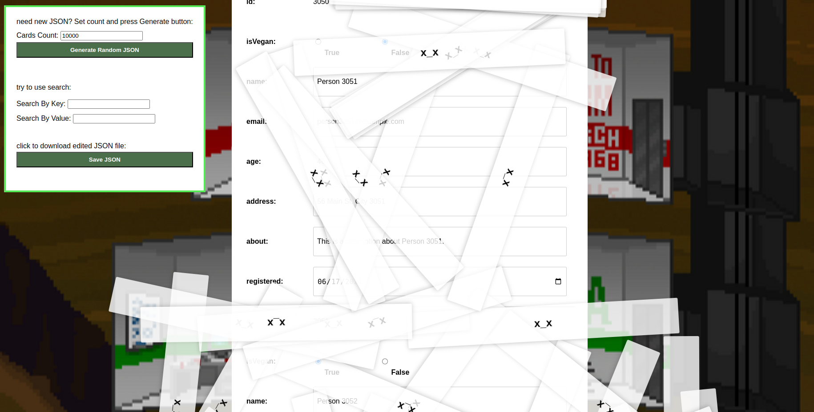

# Hello

Here you can find a JS implementation of virtual-scroll.

Made for fun. 

The implementation is framework-agnostic; here it's used with React, but React is not necessary for it.




## HOW TO RUN

```
npm install
npm run dev
```

## ISSUES

- <s>I used standard browser scroll which has vertical size restrictions. 
So if you generate a very big JSON with one million cards, for example - it will work, but the browser will not show the entire list.</s>

- <s>Performance improvements, especially with enabled search, are possible. The current version is not fully optimized.</s>

- <s>Developed for chrome</s>

- <s>In the FireFox during fast scrolling content are not rendered</s>

- <s>In Firefox, to save the input value, Enter should be pressed or focus should be lost. Saving doesn't work immediately when scrolling.</s>